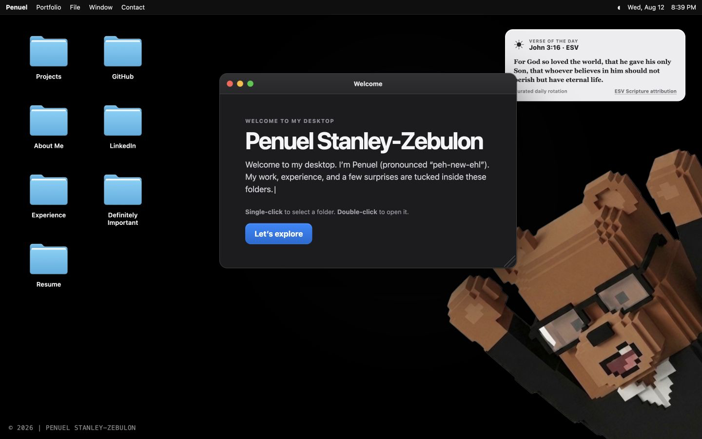

# Penuel's Mac Portfolio

An interactive macOS-inspired portfolio that turns my work, experience, and projects into a desktop you can explore.

**[Open the desktop →](https://iampenuel.vercel.app/)**



## What this is

This portfolio presents my work in human-centered AI, healthcare AI, machine learning, and product engineering through a familiar desktop metaphor. Instead of scrolling through a conventional landing page, visitors can open folders, move and resize windows, explore project details, and return to the same workspace without navigating away.

The interface is playful, but the work behind it is practical: typed React components, data-driven content, accessible interactions, responsive behavior, and carefully bounded AI features. Project and experience entries live in focused data modules, so the presentation stays consistent as the portfolio evolves. It is designed to feel personal while giving recruiters and collaborators a quick path to projects, experience, credentials, and my résumé, while still rewarding anyone who wants to explore the details.

## Highlights

- A same-page macOS-style desktop with draggable, resizable, minimizable, and stackable windows
- Finder-inspired project browsing with detailed project views and direct links to demos and source code
- Dedicated windows for experience, leadership, awards, certifications, social profiles, and a downloadable résumé
- Responsive desktop and mobile layouts with keyboard-friendly controls and reduced-motion support
- A contact composer with Formspree delivery, local draft persistence, and a direct-email fallback
- Optional browser voice dictation that never creates or uploads an audio recording
- Human-reviewed message rewriting through a separate, rate-limited Cloudflare Worker
- Small personal touches, including a rotating Scripture widget and one deliberately important folder

## Stack

| Area | Technologies |
| --- | --- |
| Frontend | Astro, React, TypeScript, CSS |
| Quality | ESLint, TypeScript, Astro build checks |
| Contact | Formspree, Web Speech API |
| Optional AI | Cloudflare Workers, Workers AI, Durable Objects |
| Hosting | Vercel |

The main site is statically built and deployed; the optional message-polish service remains isolated from the browser bundle and contact-delivery provider.

## Run locally

Node.js 22.12.0 or newer is required.

```bash
npm ci
npm run dev
```

Astro will print the local URL in the terminal. Copy `.env.example` to `.env.local` only if you want to test the configured contact delivery or optional message-polish endpoint; the portfolio remains browsable without those integrations.

For a production validation run:

```bash
npm run check
npm run build
```

## Project structure

```text
src/                         Astro page, React desktop, content data, and styles
public/                      Production images, icons, and résumé assets
workers/message-polisher/   Optional server-side message-polish service and tests
```

## Privacy & safety

- The repository contains no production secrets; local values belong in ignored environment files.
- Dictation is browser-provided, and this project does not record, store, or upload audio.
- Message rewriting sends only the draft message and selected rewrite mode to the server-side integration; it never submits the contact form.
- AI suggestions remain reviewable and editable, while server-side abuse controls and usage limits fail closed without blocking normal contact-form use.
